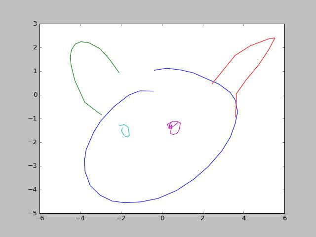
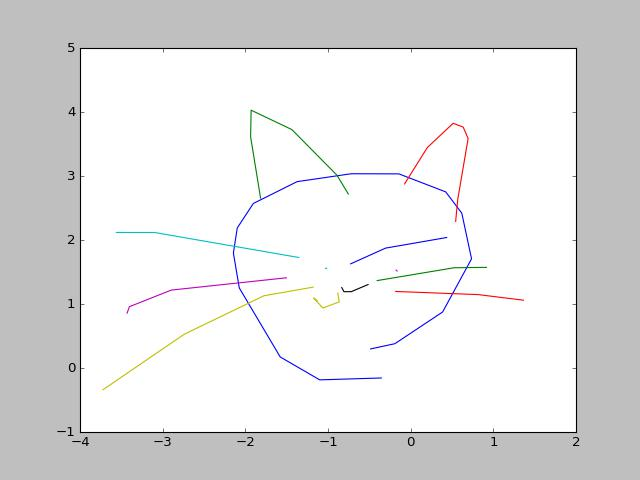

# Pytorch-Sketch-RNN
A pytorch implementation of https://arxiv.org/abs/1704.03477

In order to draw other things than cats, you will find more drawing data here: https://github.com/googlecreativelab/quickdraw-dataset

epoch 1900:

epoch 2400:

epoch 3400

Default hyperparameters for training has been found here: https://github.com/tensorflow/magenta/blob/master/magenta/models/sketch_rnn/README.md
